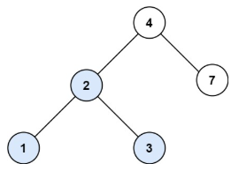

**700.二叉搜索树中的搜索**

二叉搜索树定义：父节点的左子树永远比自己小，父节点的右子树永远比自己大。



例如4的左子树【2,1,3】都是比4小的数，4的右子树【7】都是比4大的数。2的左子树[1]都是比2小，2的右子树都是比2大。这样的结构可以很轻松的找到特定值的节点。

```c#
public class Solution {
    // 搜索二叉搜索树（BST）中的目标值
    public TreeNode SearchBST(TreeNode root, int target) {  
        return SearchNode(root, target);
    }

    // 递归查找指定值的节点
    private TreeNode SearchNode(TreeNode node, int target) {
        // 如果节点为空，说明未找到目标值，返回 null
        if (node == null) return null;

        // 根据 BST 的特性进行搜索
        if (target > node.val) {
            return SearchNode(node.right, target); // 目标值在右子树
        } else if (target < node.val) {
            return SearchNode(node.left, target);  // 目标值在左子树
        } else {
            return node; // 找到目标节点
        }
    }
}

```

