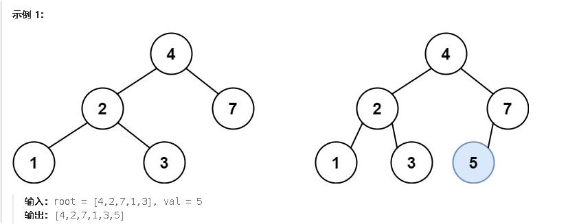

**701.二叉搜索树中的插入操作**

给定二叉搜索树（BST）的根节点 `root` 和要插入树中的值 `value` ，将值插入二叉搜索树。 返回插入后二叉搜索树的根节点。 输入数据 **保证** ，新值和原始二叉搜索树中的任意节点值都不同。

**注意**，可能存在多种有效的插入方式，只要树在插入后仍保持为二叉搜索树即可。 你可以返回 **任意有效的结果** 。



注意：只需要将要插入的节点放到空叶子节点就行了

```c#
public class Solution {
    // 主函数，调用BST方法插入值
    public TreeNode InsertIntoBST(TreeNode root, int val) {
        return BST(root, val);  // 从根节点开始插入
    }

    // 递归函数，负责在二叉搜索树中插入一个值
    public TreeNode BST(TreeNode node, int val){
        // 如果当前节点是空，表示找到了插入位置，创建新节点
        if (node == null) {
            TreeNode temp = new TreeNode(val);  // 创建一个新节点
            return temp;  // 返回新节点，作为插入点
        }

        // 如果插入的值小于当前节点值，递归插入到左子树
        if (val < node.val) {
            node.left = BST(node.left, val);  // 左子树递归插入
        }
        else {
            // 否则递归插入到右子树
            node.right = BST(node.right, val);  // 右子树递归插入
        }

        // 返回当前节点，保持二叉搜索树的结构
        return node;
    }
}

```

**`node.left = BST(node.left, val);`**：这行代码通过递归调用 `BST` 方法，进入当前节点的左子树（`node.left`），继续寻找合适的插入位置。

- 递归会继续向下找，直到找到一个空位置（`node == null`），然后在那个位置创建一个新节点。
- 新创建的节点会被返回，并且通过 `node.left =` 将其挂到父节点的左子树上。

<span style="color:#FF0000;">return node;  // 返回当前节点，保持二叉搜索树的结构</span>

这一行非常关键。每次递归调用返回时，我们都会返回当前节点。这样做是为了保持二叉搜索树的结构不变。

- 为什么要返回当前节点？
  - 因为在递归过程中，节点的左或右子树可能会发生变化（当插入新节点时，某个子树可能会有新节点插入）。
  - 返回 `node` 确保了二叉搜索树的结构不会丢失，父节点的左右子树指针始终指向正确的子树。
  - 例如，当你递归到一个空位置并插入新节点时，这个新节点会被“返回”并作为插入的子节点挂到父节点的子树上。