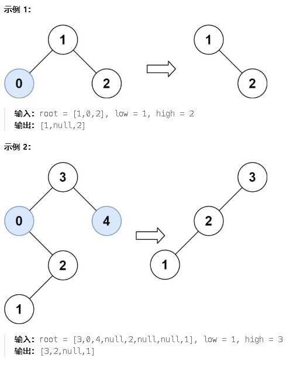

**669.修剪二叉搜索树**

给你二叉搜索树的根节点 `root` ，同时给定最小边界`low` 和最大边界 `high`。通过修剪二叉搜索树，使得所有节点的值在`[low, high]`中。修剪树 **不应该** 改变保留在树中的元素的相对结构 (即，如果没有被移除，原有的父代子代关系都应当保留)。 可以证明，存在 **唯一的答案** 。

所以结果应当返回修剪好的二叉搜索树的新的根节点。注意，根节点可能会根据给定的边界发生改变。



注意：修剪也是改指针，把当前节点的子树直接返回给当前节点的父节点。

```c#
public class Solution {
    public TreeNode TrimBST(TreeNode root, int low, int high) {
        return BST(root, low,high);
    }
    public TreeNode BST(TreeNode node, int low, int high) {
        if(node == null)return null;//遇到空就返回null
        //小于左边界和大于右边界要分两种情况讨论
        if(node.val < low){//如果小于左边界说明当前节点值小，但是当前节点的右子节点不一定不在边界内，所以要向右去遍历一下
            TreeNode temp = BST(node.right, low,high);
            return temp;//将右子树修剪完的根节点返回，在16行接收(递归return时)
        }
        if(node.val > high){//这里也是同理，左边的左子节点不一定不在边界内
            TreeNode temp = BST(node.left, low,high);
            return temp;//将当前节点的左子树修建完的根节点返回给17行(递归return时)
        }
        node.left = BST(node.left, low,high);//在这里接收左子树的修剪完的结果
        node.right = BST(node.right, low,high);
        return node;//最后一层层向上返回，直到返回整棵树的root节点
    }
}
```

