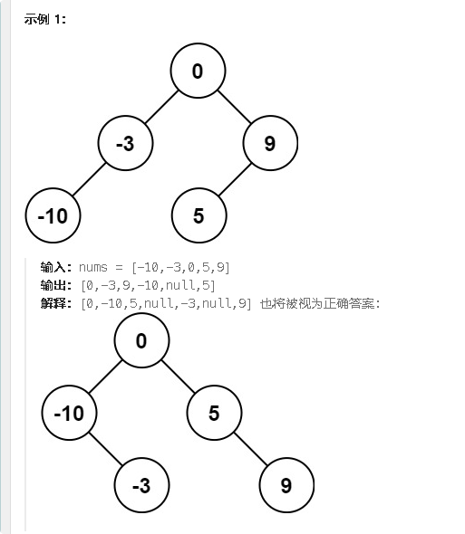

**108.将有序数组转换为二叉搜索树**

给你一个整数数组 `nums` ，其中元素已经按 **升序** 排列，请你将其转换为一棵 

平衡 二叉搜索树。



思路：找中间节点的位置，这样分割开左区间和右区间，两个区间的元素数量一样，才能是平衡二叉树，构建搜索树只需要按大小让当前根节点去指向就行了

```c#
public class Solution {
    public TreeNode SortedArrayToBST(int[] nums) {
        return BST(nums,0,nums.Length-1);
    }
    public TreeNode BST(int[] nums,int left,int right){
        //区间是左闭右闭区间
        if(left > right)return null;
        int mid = (left + right)/2;//获取中间位置，因为只有中间位置做为根节点，才会让左右的节点数量相同，才是平衡二叉树
        //下面是单层递归逻辑
        TreeNode root = new TreeNode(nums[mid]);//确定当前子树的根节点
        root.left = BST(nums,left,mid-1);//因为是递增数组，所以左边的范围里面的数都小于当前的root节点，所以放到左子树里
        root.right = BST(nums,mid+1,right);//同理
        //将结果向上返回，直至最后返回整棵树的root节点
        return root;
    }
}
```

