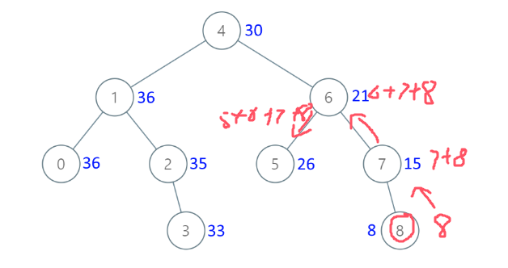

**538.把二叉搜索树转换为累加树**

给出二叉 **搜索** 树的根节点，该树的节点值各不相同，请你将其转换为累加树（Greater Sum Tree），<span style="color:#FF0000;">使每个节点 `node` 的新值等于原树中大于或等于 `node.val` 的值之和。</span>

提醒一下，二叉搜索树满足下列约束条件：

- 节点的左子树仅包含键 **小于** 节点键的节点。
- 节点的右子树仅包含键 **大于** 节点键的节点。
- 左右子树也必须是二叉搜索树。



思路：一直先向右遍历，确保都是从最大值慢慢到最小值，这个例子的遍历顺序应该是

这是栈的结构[8，7，6，5，4]、[3,2,1,0]

```c#
public class Solution {
    public TreeNode ConvertBST(TreeNode root) {
        int[] pre = new int[1]; // 使用数组来保存累加和，如果用int的话，int在递归里不会被递归改变值，因为int不是引用类型，在递归里改变了的话只是当前层会变，返回到上一层就还是初始值
        BST(root, pre);
        return root;
    }
    public void BST(TreeNode cur, int[] pre) {//因为只遍历二叉树，所以不需要返回值
        if (cur == null) return;
        // 采用右中左的顺序遍历，用一个数组存当前节点之前的累加和
        BST(cur.right, pre); // 右
        cur.val = cur.val + pre[0]; // 中
        pre[0] = cur.val; // 更新累加和
        BST(cur.left, pre); // 左，当遍历一次左子节点之后，如果当前左子节点有右节点，那么这一层就会一直往右边去遍历
        //所以不会出现值更新不正确的问题
    }
}
```

### **遍历过程**

我们从根节点 `4` 开始，按照 **右-中-左** 的顺序遍历：

1. **遍历右子树（节点 6）**：
   - 先遍历节点 `6` 的右子树（节点 `7`）。
   - 节点 `7` 的右子树是节点 `8`。
   - 节点 `8` 没有右子树，更新 `8` 的值为 `8 + 0 = 8`，`pre` 更新为 `8`。
   - 回到节点 `7`，更新 `7` 的值为 `7 + 8 = 15`，`pre` 更新为 `15`。
   - 回到节点 `6`，更新 `6` 的值为 `6 + 15 = 21`，`pre` 更新为 `21`。
   - 遍历节点 `6` 的左子树（节点 `5`）。
   - 节点 `5` 没有右子树，更新 `5` 的值为 `5 + 21 = 26`，`pre` 更新为 `26`。
2. **回到根节点 `4`**：
   - 更新 `4` 的值为 `4 + 26 = 30`，`pre` 更新为 `30`。
3. **遍历左子树（节点 1）**：
   - 先遍历节点 `1` 的右子树（节点 `2`）。
   - 节点 `2` 的右子树是节点 `3`。
   - 节点 `3` 没有右子树，更新 `3` 的值为 `3 + 30 = 33`，`pre` 更新为 `33`。
   - 回到节点 `2`，更新 `2` 的值为 `2 + 33 = 35`，`pre` 更新为 `35`。
   - 回到节点 `1`，更新 `1` 的值为 `1 + 35 = 36`，`pre` 更新为 `36`。
   - 遍历节点 `1` 的左子树（节点 `0`）。
   - 节点 `0` 没有右子树，更新 `0` 的值为 `0 + 36 = 36`，`pre` 更新为 `36`。