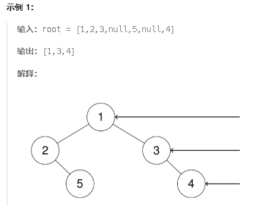

**199.二叉树的右视图**

给定一个二叉树的 **根节点** `root`，想象自己站在它的右侧，按照从顶部到底部的顺序，返回从右侧所能看到的节点值。



<span style="color:#FF0000;">思路：用层序遍历，每次只取队列里的最后出列的那个元素就行</span>

```c#
public class Solution {
    public IList<int> RightSideView(TreeNode root) {
        // 使用队列进行层序遍历
        Queue<TreeNode> queue = new Queue<TreeNode>();
        int size = 1; // 记录当前层的节点数
        List<int> result = new List<int>(); // 存储右视图的结果

        // 如果根节点不为空，则加入队列
        if (root != null) {
            queue.Enqueue(root);
        }
        else {
            return []; // 如果树为空，返回空列表
        }

        // 开始层序遍历
        while (queue.Count > 0) {
            size = queue.Count; // 获取当前层的节点数量
            
            // 遍历当前层的所有节点
            while (size > 0) {
                TreeNode temp = queue.Dequeue(); // 取出当前层的节点
                size--; // 递减当前层剩余的节点数
                
                // 当 size == 0 时，说明是当前层的最右侧节点，将其加入结果列表
                if (size == 0) {
                    result.Add(temp.val);
                }

                // 如果左子节点存在，则加入队列
                if (temp.left != null) {
                    queue.Enqueue(temp.left);
                }

                // 如果右子节点存在，则加入队列
                if (temp.right != null) {
                    queue.Enqueue(temp.right);
                }
            }
        }

        return result; // 返回右视图节点列表
    }
}
```

