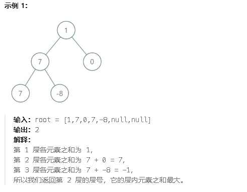

**1161.最大层内元素和**

给你一个二叉树的根节点 `root`。设根节点位于二叉树的第 `1` 层，而根节点的子节点位于第 `2` 层，依此类推。

请返回层内元素之和 **最大** 的那几层（可能只有一层）的层号



<span style="color:#FF0000;">每遍历一层就比较一下当前层的总和是不是比之前的最大总结大，如果大的话把当前层的层级赋给level，之后把当前层级加加，再进行下一层的遍历</span>

```c#
public class Solution {
    public int MaxLevelSum(TreeNode root) {
        // 如果树为空，返回0
        if (root == null) return 0;

        // 初始化队列，进行层序遍历
        Queue<TreeNode> queue = new Queue<TreeNode>();
        queue.Enqueue(root);  // 将根节点加入队列

        int max = root.val;  // 初始最大值设为根节点的值
        int level = 1;  // 当前最大层级的编号
        int currentLevel = 0;  // 当前层的总和
        int currentLevelNum = 1;  // 当前层的编号

        // 当队列中有节点时，继续进行层序遍历
        while (queue.Count > 0) {
            currentLevel = 0;  // 每层开始时，总和重置为0
            int size = queue.Count;  // 当前层的节点数

            // 遍历当前层的所有节点
            while (size > 0) {
                TreeNode temp = queue.Dequeue();  // 从队列中取出节点
                size--;  // 当前层的节点数减1
                currentLevel += temp.val;  // 将当前节点的值加到当前层的总和
                // 将左子节点加入队列
                if (temp.left != null) {
                    queue.Enqueue(temp.left);
                }
                // 将右子节点加入队列
                if (temp.right != null) {
                    queue.Enqueue(temp.right);
                }
            }
            // 在当前层遍历结束后，判断当前层的总和是否大于最大总和
            if (currentLevel > max) {
                max = currentLevel;  // 更新最大值
                level = currentLevelNum;  // 更新最大总和所在的层级
            }
            currentLevelNum++;  // 当前层的编号增加，进入下一层
        }
        return level;  // 返回最大总和所在的层级
    }
}

```

