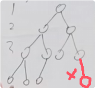
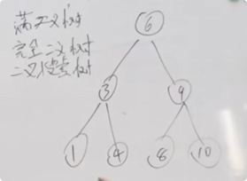
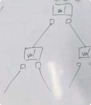
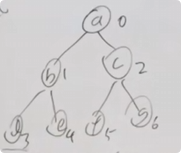
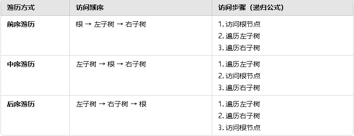

## **种类**

**满二叉树：**每个节点都有两个叶子节点，总节点数量是2^k-1，k是深度，从1开始算。

**完全二叉树**：最底部是连续的节点，底部以上都是满的节点。

如果加上了红色的节点，就不是完全二叉树了。

**二叉搜索树：**节点的左子节点都小于父节点，节点的右子节点都大于父节点.(节点有顺序)

如果要搜索4，先搜索6，4<6,往左搜到3，4>3往右搜，搜到4。时间复杂度N(logn)

**平衡二叉搜索树：**[|左子树深度| - |右子树深度| <= 1]的二叉搜索树二叉树叫平衡二叉搜索树

## 存储方式

**链式存储：**每个节点有一个值和左指针右指针，左指针指向左子节点，右指针指向右子节点。

**线性存储**：用一个数组来存放二叉树

[a,b,c,d,e,f]某个元素的子节点的索引是：2xi+1(左子节点索引),2xi+2(右子节点索引)。i是某个元素的索引

## 二叉树的遍历

**深度优先DFS**：深度优先搜索是一种沿着一条路径尽可能深入搜索的算法。在探索到某条路径的尽头（没有未访问的邻居节点）时，回溯到上一个节点并继续尝试其他路径。（能完全遍历）

从起点开始，将该节点标记为已访问。

对当前节点的每个未访问的邻居节点，递归进行深度优先搜索。

如果没有未访问的邻居，则回溯到上一个节点。

**广度优先BFS**:广度优先搜索是一种逐层遍历图或树的算法。从起点开始，依次访问与当前节点相邻的所有节点，然后继续访问下一层的节点，直到遍历完所有节点或找到目标。（更容易找到最短路径）

将起点加入队列并标记为已访问。

从队列中取出节点，访问它的所有未访问邻居。

将未访问的邻居加入队列并标记为已访问。

重复步骤 2 和 3，直到队列为空。

比较：

| **比较维度**       | **DFS（深度优先搜索）**                | **BFS（广度优先搜索）**                  |
| ------------------ | -------------------------------------- | ---------------------------------------- |
| **实现方式**       | 递归或使用栈实现                       | 使用队列实现                             |
| **搜索顺序**       | 沿着一条路径尽可能深入                 | 按距离逐层扩展                           |
| **内存使用**       | 内存需求低（递归深度与图的深度相关）   | 内存需求较高（需要存储当前层的所有节点） |
| **适用场景**       | 适合搜索整个图或树                     | 适合找到最短路径（无权图）               |
| **回溯机制**       | 需要回溯到上一个节点，继续尝试其他路径 | 不需要回溯，直接逐层扩展                 |
| **复杂度（时间）** | O(V + E)，其中 V 是顶点数，E 是边数    | O(V + E)，其中 V 是顶点数，E 是边数      |
| **复杂度（空间）** | O(V)（递归栈或显式栈的深度）           | O(V)（队列存储的最大节点数）             |

