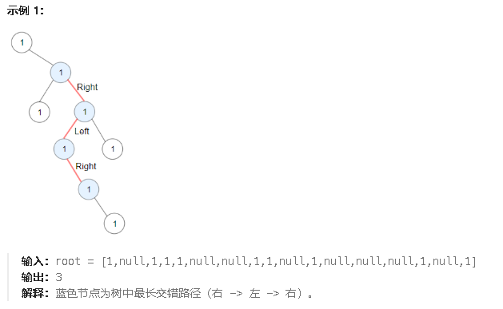

1372.二叉树中的最长交错路径

请你返回给定树中最长 **交错路径** 的长度。



确定函数参数和返回值：返回值是void，参数有(TreeNode,一个布尔记录上次是向左还是向右走了，一个int当前路径的长度，一个int最大长度)

确定终止条件：遇到空节点返回

确定单层递归：

先更新最大值。

①如果上次是向左走的，这次又向左走了，重置当前路径长度

②如果上次是向左走的，这次向右走了，当前路径长度加一

③如果上次是向右走的，这次向左走了，当前路径长度加一

④如果上次是向右走的，这次又向右走了，重置当前路径长度

代码如下

```c#
public class Solution {
    // 主函数，计算二叉树中最大 ZigZag 路径的长度
    public int LongestZigZag(TreeNode root) {
        int length = 0;  // 用于记录最大 ZigZag 路径长度
        // 从根节点开始，先向左走
        maxZigZag(root, true, 0, ref length);  
        // 再从根节点开始，向右走
        maxZigZag(root, false, 0, ref length); 
        return length;  // 返回最大 ZigZag 路径长度
    }

    // 辅助函数，递归计算每个节点的最大 ZigZag 路径长度
    public void maxZigZag(TreeNode node, bool isleft, int currentLength, ref int maxLength) {
        if (node == null) return;  // 如果当前节点为空，结束递归

        // 更新最大 ZigZag 路径长度
        maxLength = Math.Max(currentLength, maxLength);

        // 如果当前是向左走
        if (isleft == true) {
            // 1. 向左走，路径长度重置为 1
            maxZigZag(node.left, true, 1, ref maxLength);
            // 2. 向右走，路径长度增加 1
            maxZigZag(node.right, false, currentLength + 1, ref maxLength);
        }
        else { // 如果当前是向右走
            // 1. 向右走，路径长度重置为 1
            maxZigZag(node.right, false, 1, ref maxLength);
            // 2. 向左走，路径长度增加 1
            maxZigZag(node.left, true, currentLength + 1, ref maxLength);
        }
    }
}

```

