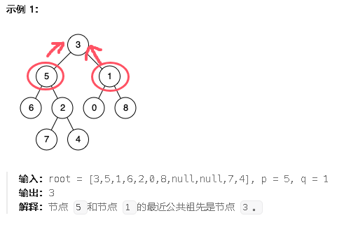
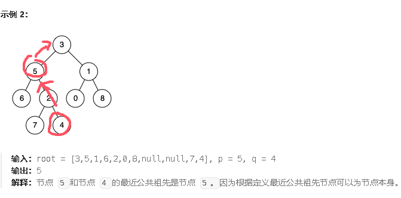

**236.二叉树的最近公共祖先**

给定一个二叉树, 找到该树中两个指定节点的最近公共祖先。

[百度百科](https://baike.baidu.com/item/最近公共祖先/8918834?fr=aladdin)中最近公共祖先的定义为：“对于有根树 T 的两个节点 p、q，最近公共祖先表示为一个节点 x，满足 x 是 p、q 的祖先且 x 的深度尽可能大（**一个节点也可以是它自己的祖先**）。”





思路：使用后序遍历(左右中)，如果当前节点等于p或者q说明找到了目标节点，直接返回当前节点，如果当前节点的左节点返回不为空，并且右节点返回不为空，那么说明这个节点是最近的祖先节点。并向上返回这个祖先节点，如果当前节点的左节点返回空，右节点返回不空，那么说明目标节点一定在右边，就把右节点返回上去，同理左节点也是。最后遍历完得到一个节点。

```c#
public class Solution {
    public TreeNode LowestCommonAncestor(TreeNode root, TreeNode p, TreeNode q) {
        return DFS(root, p, q);
    }

    // 递归查找最近公共祖先
    public TreeNode DFS(TreeNode cur, TreeNode p, TreeNode q) {
        // 如果当前节点为空，直接返回 null
        if (cur == null) return null;

        // 如果当前节点等于 p 或 q，说明找到了目标节点，直接返回当前节点
        if (cur == p || cur == q) {
            return cur;
        }

        // 递归查找左子树和右子树
        TreeNode left = DFS(cur.left, p, q);
        TreeNode right = DFS(cur.right, p, q);

        // 如果左子树和右子树都找到了目标节点，说明当前节点是最近公共祖先
        if (left != null && right != null) {
            return cur;
        }

        // 如果左子树为空，但右子树不为空，说明目标节点在右子树
        if (left == null && right != null) return right;

        // 如果右子树为空，但左子树不为空，说明目标节点在左子树
        if (left != null && right == null) return left;

        // 如果左右子树都为空，说明当前子树没有 p 或 q
        return null;
    }
}

```

参考视频

[自底向上查找，有点难度！ | LeetCode：236. 二叉树的最近公共祖先_哔哩哔哩_bilibili](https://www.bilibili.com/video/BV1jd4y1B7E2/?spm_id_from=333.337.search-card.all.click&vd_source=01ce83bfd26f457fbdf4e6ed8df8d6ad)