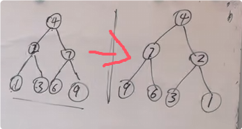

**前序和后序最好做**

```c#

public class Solution {
    public TreeNode FlipTree(TreeNode root) {
        return TreeReverse(root);
    }
    public TreeNode TreeReverse(TreeNode cur){
        if(cur == null)return cur;
        else{
            //交换指针
            TreeNode temp = cur.left;
            cur.left = cur.right;
            cur.right = temp;
            //继续递归
            TreeReverse(cur.left);
            TreeReverse(cur.right);
            //如果把交换的操作放到这就是后序
            //交换指针
            TreeNode temp = cur.left;
            cur.left = cur.right;
            cur.right = temp;
            //在每次递归完成后，将当前节点返回，并传递给上一层递归，逐层向上返回最终的结果
            return cur;
        }
    }
}
```

