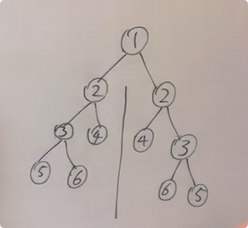

<span style="color:#FF0000;">判断是否是对称二叉树：就是判断左子树能不能翻转变成右子树，即判断左子树右子树是否可以相互翻转</span>

```c#
public class Solution {
    // 主函数：判断整个二叉树是否对称
    public bool IsSymmetric(TreeNode root) {
        // 如果根节点为null，说明空树是对称的，直接返回true
        if (root == null) return true;
        // 调用比较左右子树的辅助函数
        return Compare(root.left, root.right);
    }

    // 辅助函数：比较左右子树是否对称
    public bool Compare(TreeNode left, TreeNode right) {
        // 如果左子树为空且右子树不为空，或者左子树不为空且右子树为空，说明不对称
        if (left == null && right != null) return false;
        else if (left != null && right == null) return false;
        // 如果左右子树都为空，说明对称
        else if (left == null && right == null) return true;
        // 如果当前节点值不同，说明不对称
        else if (left.val != right.val) return false;

        // 比较左右子树的外侧（左的左与右的右）和内侧（左的右与右的左）
        bool outside = Compare(left.left, right.right);
        bool inside = Compare(left.right, right.left);

        // 如果外侧和内侧都对称，则整个树对称
        if (outside && inside) return true;
        else return false;
    }
}

```

