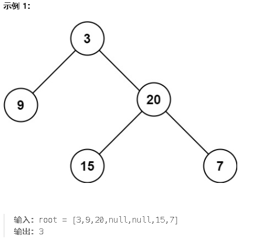

****

**104.二叉树的最大深度**

给定一个二叉树 `root` ，返回其最大深度。

二叉树的 **最大深度** 是指从根节点到最远叶子节点的最长路径上的节点数。



<span style="color:#FF0000;">二叉树最大深度就等于二叉树的最大高度！</span>采用后序遍历

```c#
public class Solution {
    // 主函数：返回二叉树的最大深度
    public int MaxDepth(TreeNode root) {
        // 调用递归函数计算树的深度
        return Height(root);
    }

    // 辅助函数：递归计算当前树的高度
    public int Height(TreeNode cur) {
        // 如果当前节点为空，返回0，表示空树的高度为0
        if (cur == null) return 0;

        // 递归计算左子树的高度
        int leftheight = Height(cur.left);//左

        // 递归计算右子树的高度
        int rightheight = Height(cur.right);//右

        // 当前节点的高度是左右子树高度的最大值 + 1（加上当前节点）//中(处理逻辑)
        int maxheight = 1 + Math.Max(leftheight, rightheight);

        // 返回当前节点的最大高度
        return maxheight;
    }
}

```

