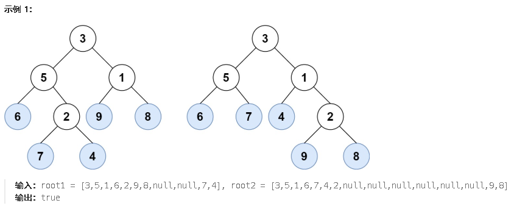

**872.叶子相似的树**

请考虑一棵二叉树上所有的叶子，这些叶子的值按从左到右的顺序排列形成一个 **叶值序列** 



遍历二叉树找叶子节点(没有左右子节点的节点就是叶子节点)，将两个树的叶子节点分别存到两个列表里，最后比较列表。

```c#
public class Solution {
    public bool LeafSimilar(TreeNode root1, TreeNode root2) {
        if(root1 == null || root2 == null)return false;
        List<int> ans1 = new List<int>();
        List<int> ans2 = new List<int>();
        ans1 = LeafValList(root1);
        ans2 = LeafValList(root2);
        return ans1.SequenceEqual(ans2);
    }
    //获取所有叶子节点
    public List<int> LeafValList(TreeNode cur){
        List<int> temp = new List<int>();
        TravelTree(cur,temp);
        return temp;
    }
    //遍历二叉树找叶子节点
    public void TravelTree(TreeNode cur,List<int> list){
        if(cur == null)return;
        else{
            if(cur.left==null && cur.right ==null){
                list.Add(cur.val);//如果没有左右子节点，就是叶子节点
            }
            else{//如果有子节点，继续遍历
                TravelTree(cur.left,list);
                TravelTree(cur.right,list);
            }
        }
    }
}
```

