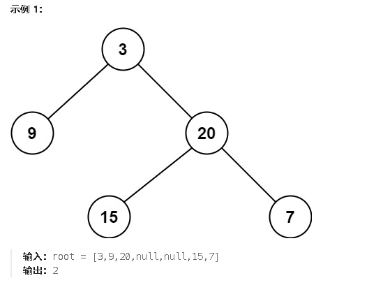

**111.二叉树的最小深度**

给定一个二叉树，找出其最小深度。

最小深度是从根节点到最近叶子节点的最短路径上的节点数量。

**说明：**叶子节点是指没有子节点的节点。


后序遍历去求，于求最大深度的差别在对中间节点的处理逻辑。如果有null节点就走另外一条路

两个都不为空就取更小的

```c#
// 递归函数：计算树的最小深度
public int MinHeight(TreeNode cur, int height) {
    // 如果当前节点为空，返回 0 深度
    if (cur == null) return 0;

    // 递归计算左子树的深度
    int leftHeight = MinHeight(cur.left, height);
    // 递归计算右子树的深度
    int rightHeight = MinHeight(cur.right, height);

    // 处理空节点的情况
    if (cur.left == null && cur.right != null) {
        // 如果左子树为空，返回右子树的深度加1
        return 1 + rightHeight;
    }
    else if (cur.left != null && cur.right == null) {
        // 如果右子树为空，返回左子树的深度加1
        return 1 + leftHeight;
    }
    else {
        // 如果左右子树都不为空，返回左右子树中较小的深度加1
        return 1 + Math.Min(leftHeight, rightHeight);
    }
}
```
}