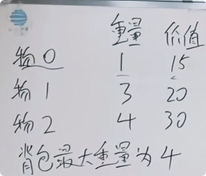

由递推公式即：`dp[i][j]` = `Math.Max(dp[i-1][j] , dp[i-1][j-w[i]]+Value[i])`可得，

**当前层（行）的数据，只由上一层（行）推出，那我们就可以把上一行的数据拷贝到当前层，然后在当前层运算，再把新的值覆盖到当前层。**大概就是把一个矩阵拆解成一行行去运算。

思路：

1.确定`dp[j]`的含义：`dp[j]`就是容量为`j`的背包，所能装的最大价值

2.递推公式：`dp[j] = Math.Max(dp[j](指的是上一层的数据) ，dp[j-w[i]] + val[i] )`

3.`dp`数组如何初始化：`dp[0] = 0,  dp[1] = -1，dp[2] = -1 ......`

这样循环从0开始，一样能计算出来`dp`数组

4.遍历顺序：`双层for循环，外层遍历物品，内层遍历背包容量`

外层顺序遍历，内层倒序遍历。

如果内层顺序遍历了，比如外层`i=0`的情况，`dp[1] = dp[0]+15 = 15`

`dp[2] = dp[2-w[i]]+15 = 30`看得出来15被加了两次，这不是正确的，所以内层要倒序遍历

如果倒序遍历。`i=0`的时候`dp[2] = dp[2-w[i]]+15 = dp[1]+15 =15`,

`dp[1] = dp[0]+15 = 15`

为什么在`dp[1]`没算出来的时候就能使用了，其实这里用的是初始值。

```c#
for(int i = 0;i<物品数量;i++){
	for(int j = 背包容量;j>=weight[i];j--){
	//为什么是大于等于weight[i]，因为对当前物品来说，如果背包容量已经比物品小了，那就没必要遍历了，直接让他保持初始值就行
	}
}
```

5.打印`dp`数组

