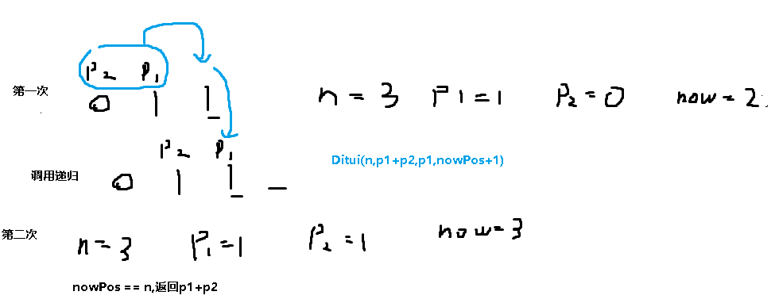

**509.斐波那契数列**

**斐波那契数** （通常用 `F(n)` 表示）形成的序列称为 **斐波那契数列** 。该数列由 `0` 和 `1` 开始，后面的每一项数字都是前面两项数字的和。也就是：

```
F(0) = 0，F(1) = 1
F(n) = F(n - 1) + F(n - 2)，其中 n > 1
```

给定 `n` ，请计算 `F(n)` 。求第n个斐波那契数

思路：动规五部曲

1.确定`dp[i]`的含义：`dp[i]`就是第`i`个斐波那契数

2.递推公式：`dp[i]` = `dp[i-1]` + `dp[i-2]`

3.`dp`数组如何初始化：`dp[0] = 0,  dp[1] = 1`

4.遍历顺序：从前向后

5.打印`dp`数组

这里我们使用递推公式，pre1变量表示当前位置的前面第一个数，pre2变量表示当前位置的前面第二个数。`nowPos`表示当前位置，n表示目标位置

如图，第二次递推中，新pre1的数值就等于原来的pre1+pre2的数值，新pre2的数值就是原来的pre1



```c#
public class Solution {
    // 计算第n个斐波那契数
    public int Fib(int n) {
        // 处理特殊情况：n为0或1时直接返回
        if (n == 0) return 0;
        if (n == 1) return 1;

        // 调用递归函数计算第n个斐波那契数
        return Ditui(n, 1, 0, 2);
    }

    // 递归函数，用于计算斐波那契数列的第n个数
    private int Ditui(int n, int pre1, int pre2, int nowPos) {
        // 如果当前位置等于n，返回前两个数的和
        if (nowPos == n) return pre1 + pre2;
        // 递归调用，更新前两个数的值，并增加当前位置
        return Ditui(n, pre1 + pre2, pre1, nowPos + 1);
    }
}
```

```c#
public class Solution
{
    // 计算第n个斐波那契数（空间优化版）
    public int Fib(int n)
    {
        // 处理特殊情况：n为0或1时直接返回
        if (n == 0) return 0;
        if (n == 1) return 1;

        int prev1 = 1; // 表示 dp[i-1]
        int prev2 = 0; // 表示 dp[i-2]

        // 使用for循环计算斐波那契数列
        for (int i = 2; i <= n; i++)
        {
            int current = prev1 + prev2; // 计算当前值
            prev2 = prev1; // 更新 dp[i-2]
            prev1 = current; // 更新 dp[i-1]
        }

        // 返回第n个斐波那契数
        return prev1;
    }
}
```

[手把手带你入门动态规划 | LeetCode：509.斐波那契数_哔哩哔哩_bilibili](https://www.bilibili.com/video/BV1f5411K7mo?spm_id_from=333.788.videopod.sections&vd_source=157a35c74b3126ceb8ea1890e7f45f07)
