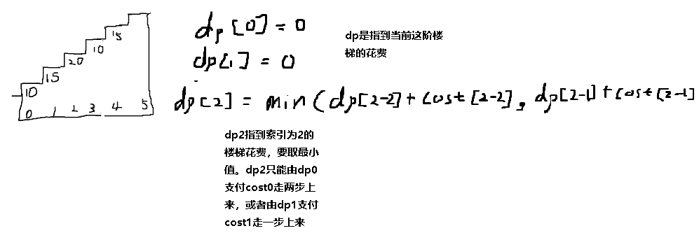

**746.使用最小花费爬楼梯**

给你一个整数数组 `cost` ，其中 `cost[i]` 是从楼梯第 `i` 个台阶向上爬需要支付的费用。一旦你支付此费用，即可选择向上爬一个或者两个台阶。

你可以选择从下标为 `0` 或下标为 `1` 的台阶开始爬楼梯。

请你计算并返回达到楼梯顶部的最低花费。

思路：动规五部曲

1.确定`dp[i]`的含义：`dp[i]`就是<span style="color:#FF0000;">到</span>第`i`阶楼梯的花费，`i`就是记录到哪阶楼梯了

2.递推公式：`dp[i]` = `dp[i] = Math.Min(dp[i-2]+cost[i-2],dp[i-1]+cost[i-1])`

3.`dp`数组如何初始化：`dp[0] = 0,  dp[1] = 0`

4.遍历顺序：从前向后

5.打印`dp`数组



因为题解给的样例

cost数组的`[cost.Length]`才是楼顶，所以我们需要计算`dp[cost.Length]`

```c#
public class Solution {
    public int MinCostClimbingStairs(int[] cost) {
        int[] dp = new int[1001];
        dp[0] = 0;
        dp[1] = 0;
        // dp[2] = Math.Min(dp[2-2] + cost[0],dp[2-1]+cost[1]);
        // dp[3] = Math.Min(dp[3-2] + cost[1],dp[3-1]+cost[2]);
        for(int i = 2;i<=cost.Length;i++){
            dp[i] = Math.Min(dp[i-2]+cost[i-2],dp[i-1]+cost[i-1]);
        }
        return dp[cost.Length];
    }
}
```

[动态规划开更了！| LeetCode：746. 使用最小花费爬楼梯_哔哩哔哩_bilibili](https://www.bilibili.com/video/BV16G411c7yZ?spm_id_from=333.788.videopod.sections&vd_source=157a35c74b3126ceb8ea1890e7f45f07)
