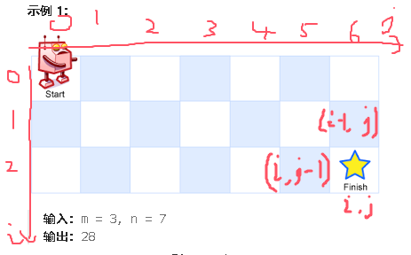

**62.不同路径**

一个机器人位于一个 `m x n` 网格的左上角 （起始点在下图中标记为 “Start” ）。

**机器人每次只能向下或者向右移动一步**。机器人试图达到网格的右下角（在下图中标记为 “Finish” ）。

问总共有多少条不同的路径？



1.确定`dp[i][j]`的含义：`dp[i][j]`就是<span style="color:#FF0000;">到</span>第`[i][j]`这个格子的走法

2.递推公式：`dp[i][j]` = `dp[i-1][j]+dp[i][j-1] `因为`dp`表示的是走法，而不是步数，所以不需要加1，因为新走法只是在原来的走法上加一个步数，只是修改了原走法，而没有产生新的走法

3.`dp`数组如何初始化：因为机器人只能往右往下走，所以第一列和第一行都初始化为1

4.遍历顺序：双层for循环，从左到右，从上到下

5.打印`dp`数组

```c#
public class Solution {
    public int UniquePaths(int m, int n) {
        int[,] dp = new int[m, n];
        // 初始化第一列
        for (int i = 0; i < m; i++) dp[i, 0] = 1;
        // 初始化第一行
        for (int j = 0; j < n; j++) dp[0, j] = 1;
        // 动态规划填充数组
        for (int i = 1; i < m; i++) {
            for (int j = 1; j < n; j++) {
                dp[i, j] = dp[i - 1, j] + dp[i, j - 1];
            }
        }
        return dp[m - 1, n - 1];
    }
}
```

[动态规划中如何初始化很重要！| LeetCode：62.不同路径_哔哩哔哩_bilibili](https://www.bilibili.com/video/BV1ve4y1x7Eu?spm_id_from=333.788.videopod.sections&vd_source=157a35c74b3126ceb8ea1890e7f45f07)
