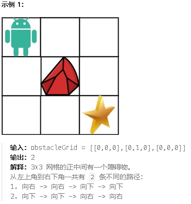
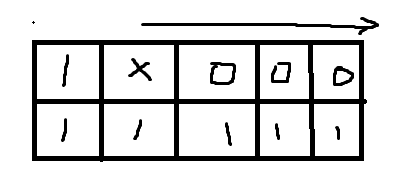

**63.不同路径Ⅱ**

给定一个 `m x n` 的整数数组 `grid`。一个机器人初始位于 **左上角**（即 `grid[0][0]`）。机器人尝试移动到 **右下角**（即 `grid[m - 1][n - 1]`）。机器人每次只能向下或者向右移动一步。

网格中的障碍物和空位置分别用 `1` 和 `0` 来表示。机器人的移动路径中不能包含 **任何** 有障碍物的方格。

返回机器人能够到达右下角的不同路径数量。

测试用例保证答案小于等于 `2 * 109`。



思路：本题难点就在  **第一行第一列遇到障碍之后的格子是0**

1.确定`dp[i][j]`的含义：`dp[i][j]`就是<span style="color:#FF0000;">到</span>第`[i][j]`这个格子的走法，如果当前格子是障碍，那就把`dp[i][j]`设为0，

2.递推公式：`dp[i][j]` = `dp[i-1][j]+dp[i][j-1] `因为`dp`表示的是走法，而不是步数，所以不需要加1，因为新走法只是在原来的走法上加一个步数，只是修改了原走法，而没有产生新的走法

3.`dp`数组如何初始化：因为机器人只能往右往下走，所以第一列和第一行应该都初始化为1，但是有障碍的话，障碍后面的格子都应该是不能走到的，都应该是0个走法。所以如果不是障碍，那么初始化当前格子的走法应该继承当前格子的前一个格子。



4.遍历顺序：双层for循环，从左到右，从上到下

5.打印`dp`数组

```c#
public class Solution {
    public int UniquePathsWithObstacles(int[][] obstacleGrid) {
        int m = obstacleGrid.Length;       // 获取网格的行数
        int n = obstacleGrid[0].Length;   // 获取网格的列数
        int[,] dp = new int[m, n];       // 定义动态规划数组，dp[i,j] 表示从起点到 (i,j) 的路径数

        // 初始化起点 (0, 0)
        if (obstacleGrid[0][0] == 1) {
            dp[0, 0] = 0; // 如果起点是障碍物，则无法到达，路径数为 0
        } else {
            dp[0, 0] = 1; // 否则，起点有一条路径
        }

        // 初始化第一列（i > 0, j = 0）
        for (int i = 1; i < m; i++) {
            if (obstacleGrid[i][0] == 1) {
                dp[i, 0] = 0; // 如果当前格子是障碍物，则无法到达，路径数为 0
            } else {
                dp[i, 0] = dp[i - 1, 0]; // 否则，路径数等于上方格子的路径数
            }
        }

        // 初始化第一行（i = 0, j > 0）
        for (int j = 1; j < n; j++) {
            if (obstacleGrid[0][j] == 1) {
                dp[0, j] = 0; // 如果当前格子是障碍物，则无法到达，路径数为 0
            } else {
                dp[0, j] = dp[0, j - 1]; // 否则，路径数等于左方格子的路径数
            }
        }

        // 填充动态规划数组（i > 0, j > 0）
        for (int i = 1; i < m; i++) {
            for (int j = 1; j < n; j++) {
                if (obstacleGrid[i][j] == 1) {
                    dp[i, j] = 0; // 如果当前格子是障碍物，则无法到达，路径数为 0
                } else {
                    dp[i, j] = dp[i - 1, j] + dp[i, j - 1]; // 否则，路径数等于上方格子和左方格子路径数之和
                }
            }
        }

        // 返回到达终点 (m-1, n-1) 的路径数
        return dp[m - 1, n - 1];
    }
}
```

[动态规划，这次遇到障碍了| LeetCode：63. 不同路径 II_哔哩哔哩_bilibili](https://www.bilibili.com/video/BV1Ld4y1k7c6?spm_id_from=333.788.videopod.sections&vd_source=157a35c74b3126ceb8ea1890e7f45f07)
