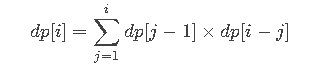
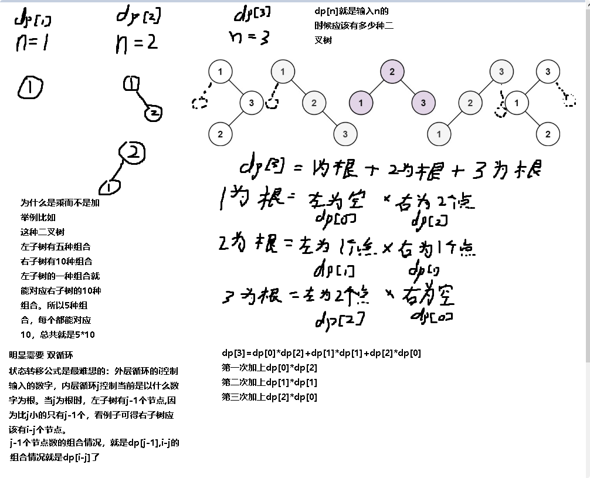

**96.不同的二叉搜索树**

给你一个整数 `n` ，求恰由 `n` 个节点组成且节点值从 `1` 到 `n` 互不相同的 **二叉搜索树** 有多少种？返回满足题意的二叉搜索树的种数。

题意：使用`1-n`的数字构造二叉搜索树，返回树的个数。

思路：

1.确定`dp[i]`的含义：`dp[i]`就是数字`i`对应的包含`i`个节点的二叉树组合数

2.递推公式： 

3.`dp`数组如何初始化：`dp[0] = 1,  dp[1] = 1，dp[2] = 2`

4.遍历顺序：`从3到n，j从1到i`

5.打印`dp`数组




```c#
public class Solution {
    public int NumTrees(int n) {
        int[] dp = new int[10001];
        dp[0] = 1;//空二叉树也是一个二叉搜索树
        dp[1] = 1;
        dp[2] = 2;
        for(int i = 3;i<=n;i++){
            for(int j = 1;j<=i;j++){
                //如果选j作为头节点，左子树有j-1个节点,看例子可得右子树应该有i-j个节点
                dp[i] += dp[j-1] * dp[i-j];
            }
        }
        return dp[n];
    }
}
```

[动态规划找到子状态之间的关系很重要！| LeetCode：96.不同的二叉搜索树_哔哩哔哩_bilibili](https://www.bilibili.com/video/BV1eK411o7QA?spm_id_from=333.788.videopod.sections&vd_source=157a35c74b3126ceb8ea1890e7f45f07)

动态规划不是能只靠看就能做出来的，要手写然后总结规律。