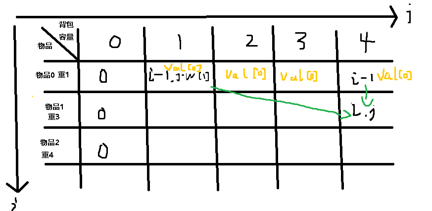

**1.背包问题概述：**

  01背包，有n种物品，每种物品只有一个，代入塔科夫，一个背包装各种物品，每种物品价值和大小不一样，问最多能装多少钱

完全背包，有n种物品，每种物品有无限个

多重背包，有n种物品，每种物品个数各不相同

**2.背包暴力解法**

用回溯算法搜索出所有可能性，然后暴力更新最大值

**3.dp数组的含义**

`dp[i][j]`表示物品的下标`i`（编号）任取，放进容量为`j`的背包里

**4.递推公式**

当前背包`dp[i][j]`价值，由放不放物品`i`推出。如果不放物品`i`，背包`dp[i][j]`价值 = `dp[i-1][j]`，

如果放物品`i`，那么这时候整个物品集就被分成两部分，1到`i-1`和第`i`个，而这是`i`是确定要放进去的，那么就把j空间里的`w[i]`给占据了,`w[i]`是物品的重量数组。那么`j`容量的背包就剩下`j-w[i]`的容量了，那这时候只要在没放`i`的`j-w[i]`空间下构造出最大价值就行，就是`dp[i-1][j-w[i]]`,这是之前的最大价值，再加上`Value[i]`就是放`i`的时候的最大价值了。所以当前背包的状态只由放`i`和不放`i`决定，就取这两个状态的最大值即可。

即：`dp[i][j]` = `Math.Max(dp[i-1][j] , dp[i-1][j-w[i]]+Value[i])`

**5.dp数组初始化**

由图可知，`[i][j]`的上一行是一定要初始化的，那`j=0`时的第一列也要初始化。

`[i][j]`这一格的话，初始化成多少都可以，因为`dp[i][j]` 取值只与其他的格子有关，与自身无关

**6.遍历顺序`/`打印`dp`数组**

先遍历背包或者先遍历物品都可以，只要当前格子的左上角和左上方有值就行