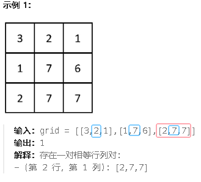

**2352.相等行列对**

给你一个下标从 **0** 开始、大小为 `n x n` 的整数矩阵 `grid` ，返回满足 `Ri` 行和 `Cj` 列相等的行列对 `(Ri, Cj)` 的数目*。*

如果行和列以相同的顺序包含相同的元素（即相等的数组），则认为二者是相等的。



思路：把每一列都存到表里，然后每一行与“列的表”比较，如果每个列都是不相同的就加一次count，如果有n个相同的列，就加列的哈希值n。

```c#
using System;
using System.Collections.Generic;

public class Solution {
    public int EqualPairs(int[][] grid) {
        int n = grid.Length;
        int count = 0;

        // 哈希表存储每行的哈希值
        Dictionary<string, int> rowHashes = new Dictionary<string, int>();

        // 遍历每一行，将每行转为哈希值并存储到字典中
        for (int i = 0; i < n; i++) {
            string rowHash = string.Join(",", grid[i]);  // 将每行转为字符串
            if (!rowHashes.ContainsKey(rowHash)) {
                rowHashes[rowHash] = 0;
            }
            rowHashes[rowHash]++;  // 记录每行哈希值出现的次数
        }

        // 遍历每一列，计算其哈希值并与行哈希值进行比较
        for (int j = 0; j < n; j++) {
            List<int> column = new List<int>();
            for (int i = 0; i < n; i++) {
                column.Add(grid[i][j]);  // 构建第 j 列
            }

            string columnHash = string.Join(",", column);  // 将列转为字符串
            if (rowHashes.ContainsKey(columnHash)) {
                count += rowHashes[columnHash];  // 如果行哈希值存在，则加上相应的数量
            }
        }

        return count;
    }
}

```

