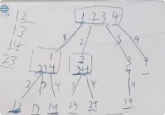

**77.组合**

给定两个整数 `n` 和 `k`，返回范围 `[1, n]` 中所有可能的 `k` 个数的组合。

你可以按 **任何顺序** 返回答案。

思路：先抽象成树形结构



第一步，确定递归函数参数和返回值，参数有n，k，和start index用来知道要开始的位置，比如回溯完[1,2]之后start index变为3,回溯[1,3],start index变为4，得到[1,4]

第二步，确定终止条件,当当前路径path有k个元素的时候，就该把当前path加入到result里面

第三步，单层递归逻辑，把当前节点加入path，然后往下递归，递归出来之后弹出一个元素然后再第二次for循环

```c#
public class Solution {
    public List<int> path = new List<int>();
    public List<IList<int>> result = new List<IList<int>>();

    public IList<IList<int>> Combine(int n, int k) {
        int startindex = 1;
        BackTracking(n,k,startindex);
        return result;
    }
    public void BackTracking(int n,int k,int startindex){
        if(path.Count == k){//当当前路径有两个元素，表明已经找到一个结果了，将此结果的copy加入到结果集
            result.Add(new List<int>(path)); // 添加 path 的副本
            return;
        }
        for(int i = startindex;i<=n-(k-path.Count)+1;i++){//剪枝的操作i<=n-(k-path.Count)+1，[n-(k-path.Count)+1]是还需要多少个元素
                                                          //如果i大于[n-(k-path.Count)+1]，说明剩下的元素不够了，那就直接不进入循环
            path.Add(i);//对应处理当前节点
            BackTracking(n,k,i + 1);//递归，例如选中1之后递归2，3，4
            path.RemoveAt(path.Count-1);//回溯逻辑，弹出path的最后一个数
        }
    }
}
```

参考[带你学透回溯算法-组合问题（对应力扣题目：77.组合）| 回溯法精讲！_哔哩哔哩_bilibili](https://www.bilibili.com/video/BV1ti4y1L7cv?spm_id_from=333.788.videopod.sections&vd_source=01ce83bfd26f457fbdf4e6ed8df8d6ad)

