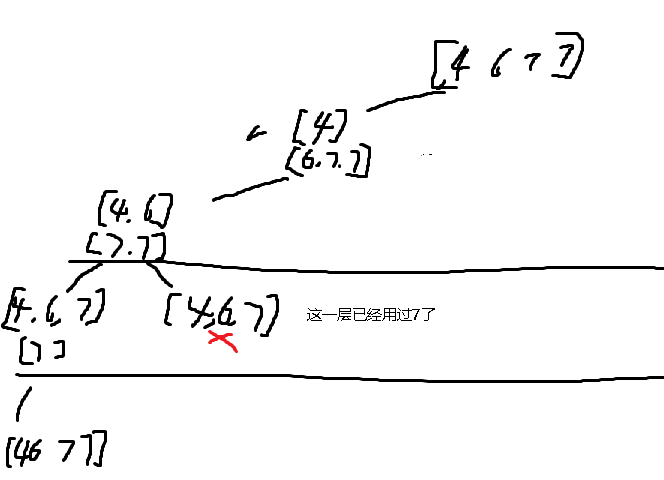

**491.非递减子序列**

给你一个整数数组 `nums` ，找出并返回所有该数组中不同的递增子序列，递增子序列中 **至少有两个元素** 。你可以按 **任意顺序** 返回答案。

数组中可能含有重复元素，如出现两个整数相等，也可以视作递增序列的一种特殊情况。

**示例 1：**

```
输入：nums = [4,6,7,7]
输出：[[4,6],[4,6,7],[4,6,7,7],[4,7],[4,7,7],[6,7],[6,7,7],[7,7]]
```

**示例 2：**

```
输入：nums = [4,4,3,2,1]
输出：[[4,4]]
```

<span style="color:#FF0000;">因为要从原数组里分割出来新的path，所以不能对原数组进行排列，然后用bool数组去重！</span>

需要<span style="color:#FF3333;">判断新加入的元素是不是大于path的最后一个元素</span>，且需要去重，例如选完[4,6,7]，[4,6,7,7]回溯到[4,6]时，不能再选[4,6,7]了。这一层已经选过了7。



这次使用hashset去重，

```c#
public class Solution {
    public List<int> path = new List<int>();
    public List<IList<int>> result = new List<IList<int>>();
    public IList<IList<int>> FindSubsequences(int[] nums) {
        BackTracking(nums, 0);
        return result;
    }

    public void BackTracking(int[] nums, int startindex) {
        if (path.Count >= 2) {
            result.Add(new List<int>(path));
        }
        
        HashSet<int> usedmap = new HashSet<int>(); // 用于树层去重，这是树层的逻辑，for循环里面是向下递归的逻辑
        
        // 单层递归逻辑
        for (int i = startindex; i < nums.Length; i++) {
            // 跳过重复的元素
            if (usedmap.Contains(nums[i])) continue;
            // 如果当前路径为空或递增，则继续添加
            if (path.Count == 0 || nums[i] >= path[path.Count - 1]) {
                path.Add(nums[i]);
                usedmap.Add(nums[i]); // 标记当前数字已经使用
                BackTracking(nums, i + 1); // 递归调用
                path.RemoveAt(path.Count - 1); // 回溯，移除当前数字
            }
        }
    }
}

```

