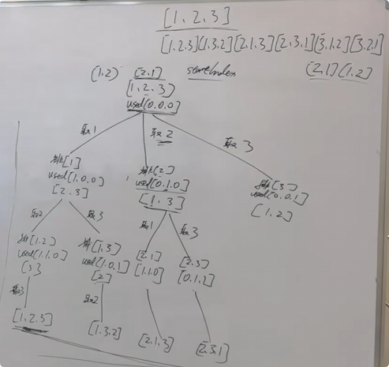

**46.全排列**

给定一个不含重复数字的数组 `nums` ，返回其 *所有可能的全排列* 。你可以 **按任意顺序** 返回答案。

**示例 1：**

```
输入：nums = [1,2,3]
输出：[[1,2,3],[1,3,2],[2,1,3],[2,3,1],[3,1,2],[3,2,1]]
```



思路：用一个used数组表示是否用过，每次该取下一个元素的时候，就在没用过的元素里面取。

```c#
public class Solution {
    public List<int> path = new List<int>();
    public List<IList<int>> result = new List<IList<int>>();
    public bool[] usedmap = new bool[7];
    public IList<IList<int>> Permute(int[] nums) {
        BackTracking(nums);
        return result;
    }
    public void BackTracking(int[] nums){//不使用startindex去控制起点，因为要全部元素都在才算排列
        //终止条件-收获结果
        if(path.Count == nums.Length){
            result.Add(new List<int>(path));
            return;
        }
        for(int i = 0;i<nums.Length;i++){
            if(usedmap[i] == true)continue;//如果被使用了就跳过这个元素
            path.Add(nums[i]);
            usedmap[i] = true;
            BackTracking(nums);
            path.RemoveAt(path.Count-1);//弹出
            usedmap[i] = false;
        }
    }
}
```

[组合与排列的区别，回溯算法求解的时候，有何不同？| LeetCode：46.全排列_哔哩哔哩_bilibili](https://www.bilibili.com/video/BV19v4y1S79W?spm_id_from=333.788.videopod.sections&vd_source=01ce83bfd26f457fbdf4e6ed8df8d6ad)