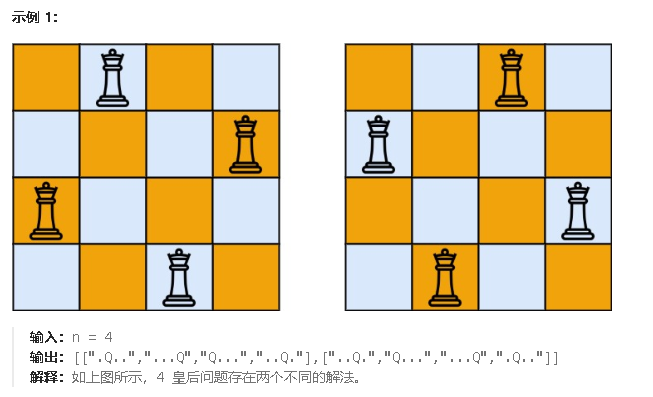
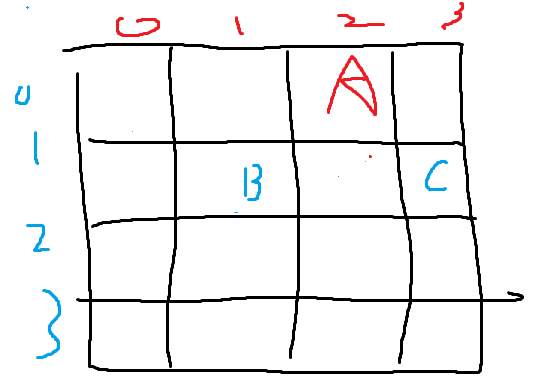

**51.N皇后**

按照国际象棋的规则，皇后可以攻击与之处在同一行或同一列或同一斜线上的棋子。

**n 皇后问题** 研究的是如何将 `n` 个皇后放置在 `n×n` 的棋盘上，并且使皇后彼此之间不能相互攻击。

给你一个整数 `n` ，返回所有不同的 **n 皇后问题** 的解决方案。

每一种解法包含一个不同的 **n 皇后问题** 的棋子放置方案，该方案中 `'Q'` 和 `'.'` 分别代表了皇后和空位。



因为按行递归，所以每一行自动就会有一个棋子，所以不需要对行进行判断。列需要判断，每个棋子必须独占一列。对角线需要判断，主对角线和副对角线都得没有棋子，即当前棋子所在的主副对角线没有被占用。在代码里的话就是，

- **主对角线**（左上到右下）：如果两个皇后的行号减去列号的值相同，则它们在同一主对角线上。
  - 例如：`(row1 - col1) == (row2 - col2)`。
- **副对角线**（右上到左下）：如果两个皇后的行号加上列号的值相同，则它们在同一副对角线上。
  - 例如：`(row1 + col1) == (row2 + col2)`。



假如A(0,2)已经落子，则会修改主对角线数组`MainDiagonalmap[0-2+4=2]`为true也会修改副对角线数组`SubDiagonalmap[0+2=2]`为true（为了避免行减列为负数所以加上一个n，这里n为4）当要落子B的时候，会检查`MainDiagonalmap[1-1=0]`是不是false，发现是，再检查`SubDiagonalmap[1+1=2]`是不是false，发现不是，则不落子B。当要落子C的时候会检查`MainDiagonalmap[1-3+4=2]`是不是false，发现不是，则不落子C。

```c#
public class Solution
{
    public List<StringBuilder> path = new List<StringBuilder>();
    public List<IList<string>> result = new List<IList<string>>();
    public bool[] Columnusedmap = new bool[10]; // 记录被用过的列
    public bool[] MainDiagonalmap = new bool[20]; // 记录主对角线（行号 - 列号 + n），加n是因为有可能（行-列）是负数，都加上一个n就不会是负数了
    public bool[] SubDiagonalmap = new bool[20]; // 记录副对角线（行号 + 列号）
    public int nowRow = 0; // 记录当前到第几行了
    public IList<IList<string>> SolveNQueens(int n)
    {
        // 初始化棋盘，添加 n 个 StringBuilder，每个 StringBuilder 初始化为 n 个 '.'
        for (int i = 0; i < n; i++)
        {
            StringBuilder sb = new StringBuilder(new string('.', n));
            path.Add(sb);
        }
        BackTracking(n, 0);
        return result;
    }
    // 回溯算法
    public void BackTracking(int n, int nowRow)
    {
        // 收获结果
        if (nowRow == n)//只要当前行到了最后一行，那么就能收获结果。如果结果不合法根本不会走到这一步
        {
            List<string> stringList = path.Select(sb => sb.ToString()).ToList();
            result.Add(new List<string>(stringList));
            return;
        }
        // 单层递归
        for (int i = 0; i < n; i++)
        {
            // 检查列冲突和对角线冲突
            if (Columnusedmap[i]==false && MainDiagonalmap[nowRow - i + n]==false && SubDiagonalmap[nowRow + i]==false)
            {
                // 放置皇后
                path[nowRow][i] = 'Q';
                Columnusedmap[i] = true;
                MainDiagonalmap[nowRow - i + n] = true;
                SubDiagonalmap[nowRow + i] = true;
                // 递归到下一行
                BackTracking(n, nowRow + 1);
                // 回溯
                path[nowRow][i] = '.';
                Columnusedmap[i] = false;
                MainDiagonalmap[nowRow - i + n] = false;
                SubDiagonalmap[nowRow + i] = false;
            }
        }
    }
}
```

