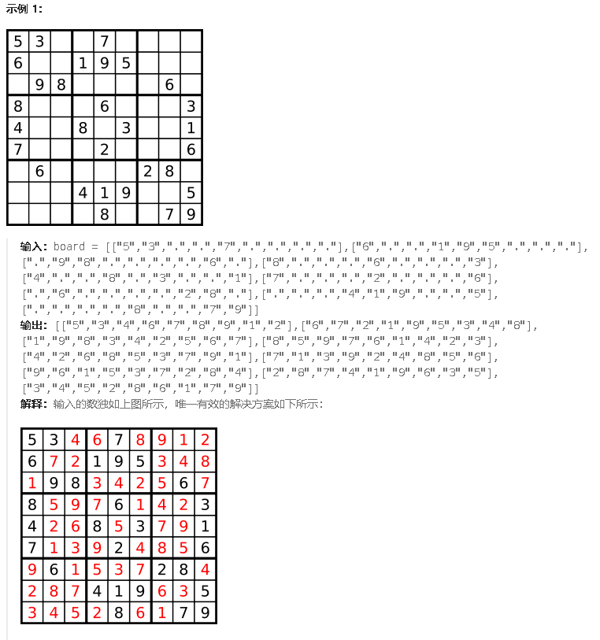

**37.解数独<span style="color:#FF0000;">困难</span>**

编写一个程序，通过填充空格来解决数独问题。

数独的解法需 **遵循如下规则**：

1. 数字 `1-9` 在每一行只能出现一次。
2. 数字 `1-9` 在每一列只能出现一次。
3. 数字 `1-9` 在每一个以粗实线分隔的 `3x3` 宫内只能出现一次。（请参考示例图）

数独部分空格内已填入了数字，空白格用 `'.'` 表示。



- `board.length == 9`
- `board[i].length == 9`
- `board[i][j]` 是一位数字或者 `'.'`
- 题目数据 **保证** 输入数独仅有一个解（<span style="color:#FF0000;">说明搜到一个答案之后就可以返回了</span>）

本题与之前的回溯算法的区别是：本题是<span style="color:#FF0000;">二维递归</span>，有一个for1嵌套一个for2，for2里面包含递归函数。对于每一个空格子，如果需要填入数字，需要判断<span style="color:#FF0000;">本行</span>放这个数字行不行，再判断<span style="color:#FF0000;">本列</span>放这个数字行不行。递归是去判断放[1,9]的某个数字。

```c#
public class Solution {
    public void SolveSudoku(char[][] board) {
        BackTracking(board);
    }
    public bool BackTracking(char[][] board){//返回值是bool，因为一个输入仅能有一个答案，所以仅有一个答案，用bool可以
        //不必写终止条件，当数填满了，代表找到答案了。也不存在数填不满的情况，因为如果一个地方，先按列搜索1-9都放不了，那直接返回false。
        //相当于提前终止了
        for(int i = 0;i<board.Length;i++){//遍历行
            for(int j = 0;j<board[0].Length;j++){//遍历列
                if(board[i][j] == '.'){//如果是空的
                    for(char k = '1';k<='9';k++){//依次放1-9
                        if(isVaild(i,j,k,board) == true){//合法才继续递归
                            board[i][j] = k;
                            if(BackTracking(board) == true)return true;//找到一组合适的直接返回
                            board[i][j] = '.';
                        }
                    }
                    return false;//如果对某个空格填入1-9都不行，return false，返回上一层。可能是因为之前的数填的不对，影响了当前格子
                }
            }
        }
        return true;//每个格子都遍历完没有返回false,说明找到答案了，依次出栈
    }
    //判断放数是否合法
    public bool isVaild(int row,int column,char val,char[][] board){
        //先判断行是否有重复元素
        for(int i = 0;i<board.Length;i++){
            if(board[row][i] == val)return false;
        }
        //再判断列是否重复元素
        for(int i = 0;i<board.Length;i++){
            if(board[i][column] == val)return false;
        }
        //再判断当前3x3的宫内有没有重复元素
        int startRow = (row/3)*3;//获取3x3宫内的开始行
        int startColumn= (column/3)*3;//获取3x3宫内的开始列
        for(int i = startRow;i<startRow+3;i++){//判断行(判断9方格里是否重复)
            for(int j = startColumn;j<startColumn+3;j++){//判断列
                if(board[i][j]==val)return false;
            }
        }
        //全部走完没有return false
        return true;
    }
}
```

错误点：**问题 1：`for` 循环中的变量错误**

```
for (int j = 0; i < board[0].Length; j++) { // 遍历列
```


这里应该是 `j < board[0].Length`，但你写成了 `i < board[0].Length`，导致死循环或越界。

**问题 2：3x3 宫格检查的范围错误**

- 

  ```
  for (int i = 0; i < startRow + 3; i++) { // 判断行
      for (int j = 0; j < startColumn + 3; j++) { // 判断列
          if (board[i][j] == val) return false;
      }
  }
  ```


  这里的 `i` 和 `j` 应该从 `startRow` 和 `startColumn` 开始，而不是从 `0` 开始。否则会检查错误的区域。

[回溯算法二维递归？解数独不过如此！| LeetCode：37. 解数独_哔哩哔哩_bilibili](https://www.bilibili.com/video/BV1TW4y1471V?spm_id_from=333.788.videopod.sections&vd_source=01ce83bfd26f457fbdf4e6ed8df8d6ad)

