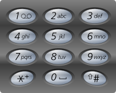

**17.电话号码的字母组合**

给定一个仅包含数字 `2-9` 的字符串，返回所有它能表示的字母组合。答案可以按 **任意顺序** 返回。

给出数字到字母的映射如下（与电话按键相同）。注意 1 不对应任何字母。



**示例 1：**

```
输入：digits = "23"
输出：["ad","ae","af","bd","be","bf","cd","ce","cf"]
```

```c#
public class Solution {
    // 创建 StringBuilder 对象
    public StringBuilder path = new StringBuilder("");//存临时答案
    public List<string> result = new List<string>();//存最终答案
    public string[] letterMap = {
        "",//0
        "",//1
        "abc",//2
        "def",//3
        "ghi",//4
        "jkl",//5
        "mno",//6
        "pqrs",//7
        "tuv",//8
        "wxyz"//9
    };
    public IList<string> LetterCombinations(string digits) {
        BackTracking(digits, 0);
        return result;
    }
    public void BackTracking(string digits, int index) {
        // 如果路径长度等于 digits 的长度，说明已经找到一个完整的组合
        if (path.Length == digits.Length) {
            if(digits.Length == 0)return;//处理特殊情况，当digits为空时
            result.Add(path.ToString());
            return;
        }

        // 获取当前数字对应的字母
        int digit = digits[index] - '0'; //将字符转换为数字，例如取char的2，减去char的0就变成int的2了
        string letters = letterMap[digit];//获取2对应的字母表即"abc"
        
        // 遍历当前数字对应的所有字母
        for (int i = 0; i < letters.Length; i++) {
            path.Append(letters[i]); // 添加当前字母
            BackTracking(digits, index + 1); // 递归处理下一个数字，即3
            path.Remove(path.Length - 1, 1); // 回溯，移除最后一个字母
        }
    }
}
```

