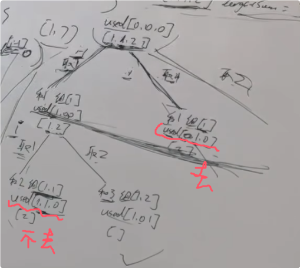

**40.组合总和Ⅱ**

给定一个候选人编号的集合 `candidates` 和一个目标数 `target` ，找出 `candidates` 中所有可以使数字和为 `target` 的组合。

`candidates` 中的每个数字在每个组合中只能使用 **一次** 。

**注意：**解集不能包含重复的组合。 

<span style="font-weight:bold;">要有去重的操作，即去掉重复的答案</span>

**示例 1:**

```
输入: candidates = [10,1,2,7,6,1,5], target = 8,
输出:
[
[1,1,6],
[1,2,5],
[1,7],
[2,6]
]
```

**树层去重：**指的是对一个排序完的数组，例如[1,1,2,5,6,7,10]当第一个1取了[1,2,5]之后，不去重的话第二个1依旧可以取[1，2，5]，这样就会有重复的答案。树层去重的条件是：当前元素和前一个元素值相同，并且前一个元素没有被使用过.

**树枝去重：**指的是对一个排序完的数组，例如[1,1,2,5,6,7,10]当第一个1取了[1]之后，不能再有第二个1，条件是当前元素和前一个元素值相同，并且前一个元素已经被使用过.

本题使用树层去重



```c#
public class Solution {
    // 存储当前路径（即当前组合）
    public List<int> path = new List<int>();
    // 存储所有符合条件的组合
    public List<IList<int>> result = new List<IList<int>>();
    // 记录某个元素是否被使用过，下标对应 candidates 数组里的下标
    public bool[] usedMap = new bool[100];

    // 主函数，返回所有符合条件的组合
    public IList<IList<int>> CombinationSum2(int[] candidates, int target) {
        int startIndex = 0; // 起始索引，用于控制递归中的遍历起点
        int sum = 0; // 当前路径的和
        Array.Sort(candidates); // 去重要先排序，方便后续跳过重复元素
        BackTracking(candidates, target, startIndex, sum); // 开始回溯
        return result; // 返回结果
    }

    // 回溯函数
    public void BackTracking(int[] candidates, int target, int startIndex, int sum) {
        // 如果当前路径的和等于目标值，将当前路径加入结果集
        if (sum == target) {
            result.Add(new List<int>(path)); // 注意：需要新建一个 List，避免引用问题
            return;
        }
        // 如果当前路径的和已经超过目标值，直接返回
        if (sum > target) return;

        // 单层递归逻辑
        for (int i = startIndex; i < candidates.Length; i++) {
            // 去重操作：如果当前元素与前一个元素相同，并且前一个元素未被使用过，则跳过
            // usedMap[i-1] == false 保证是树层去重，而不是树枝去重
            // 例如：[1,1,6]，第一个 1 被使用后，usedMap[0] = true，第二个 1 不会被跳过
            if (i > 0 && candidates[i] == candidates[i - 1] && usedMap[i - 1] == false) {
                continue;
            }

            // 将当前元素加入路径
            path.Add(candidates[i]);
            sum += candidates[i]; // 更新当前路径的和
            usedMap[i] = true; // 标记当前元素为已使用

            // 递归进入下一层，注意 startIndex 为 i+1，避免重复使用同一个元素
            BackTracking(candidates, target, i + 1, sum);

            // 回溯：撤销当前选择
            sum -= candidates[i]; // 恢复当前路径的和
            path.RemoveAt(path.Count - 1); // 移除当前元素
            usedMap[i] = false; // 标记当前元素为未使用
        }
    }
}
```

[回溯算法中的去重，树层去重树枝去重，你弄清楚了没？| LeetCode:40.组合总和II_哔哩哔哩_bilibili](https://www.bilibili.com/video/BV12V4y1V73A?spm_id_from=333.788.videopod.sections&vd_source=01ce83bfd26f457fbdf4e6ed8df8d6ad)