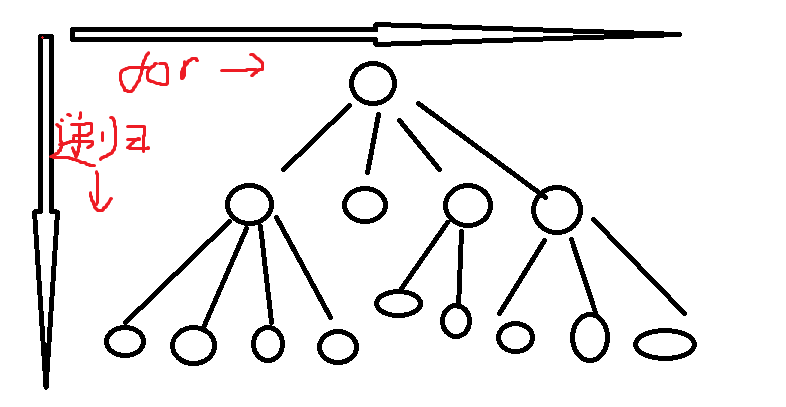

**1.回溯是什么？**

回溯是一种通过递归探索所有可能解的算法策略，常用于解决组合、排列、子集等问题。它的核心思想是尝试所有可能的路径，并在发现当前路径无法达到目标时回退到上一步，尝试其他路径。

一般来说递归函数的下面就是写的回溯的过程。通常说回溯函数其实就是指递归函数

**2.回溯搜索法是什么？**

回溯搜索是纯暴力的搜索，for循环根本搜不出来的问题，用回溯可以把所有的结果暴力出来。

**3.回溯算法能解决什么问题？**

首先是**组合问题**，比如给定组合[1,2,3,4]找出里面长度为2的组合，例如[1,2]，[2,3]，[3,4]等。(不要求顺序)

其次是**切割问题**，比如给定一个字符串和切割条件，问有几种切割方式。

再就是**子集问题**，比如给定集合[1,2,3,4]，找出这个集合的子集，跟组合问题也差不多。

然后是**排列问题**，与组合不同排列要求顺序，例如1,2可以有两种排列，[1,2],[2,1],但是只有一种组合[1,2]

最后是**棋盘问题**，N皇后，解数独。

**4.如何理解回溯法？**

回溯法是一种抽象的算法，最好抽象成图形结构去理解。都是可以抽象成这种树形结构



**5.回溯法的模板**

```c#
void Backtracking(参数们){
	if(终止条件){
		//收集结果......
        return;
	}
    //单层搜索的逻辑
    for(集合的元素集，意思就是遍历整个集合){
        //处理节点的逻辑......
        递归函数;
        回溯操作;//撤销的过程，有回溯才能找到所有可能。 
        //例如加入1，[1]，再加入2,[1,2]，再弹出2加入3，[1,3],以此类推才能得到所有可能。
    }
}
```

**6.如何做回溯？**

第一步，确定递归函数参数和返回值

第二步，确定终止条件

第三步，单层递归逻辑
