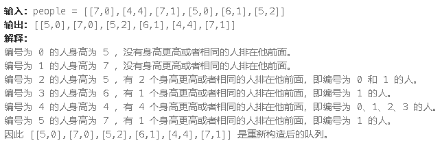
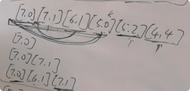

**406.根据身高重建队列**

假设有打乱顺序的一群人站成一个队列，数组 `people` 表示队列中一些人的属性（不一定按顺序）。每个 `people[i] = [hi, ki]` 表示第 `i` 个人的身高为 `hi` ，前面 **正好** 有 `ki` 个身高大于或等于 `hi` 的人。

请你重新构造并返回输入数组 `people` 所表示的队列。返回的队列应该格式化为数组 `queue` ，其中 `queue[j] = [hj, kj]` 是队列中第 `j` 个人的属性（`queue[0]` 是排在队列前面的人）。



思路：只要是有两个维度要考虑的，就要先弄好一个维度。先按身高从小到大排，然后从前往后根据`kj`去插入到答案队列里。因为已经按身高排好序了



所以[6,1]插入到中间去不会改变答案的正确性。

```c#
public class Solution {
    public int[][] ReconstructQueue(int[][] people) {
        // 将数组转换为 List
        List<int[]> peopleList = people.ToList();

        // 排序：先按身高降序，再按 k 升序
        peopleList.Sort((a, b) => {
            int compareHeight = b[0].CompareTo(a[0]); // 身高降序
            if (compareHeight != 0) {
                return compareHeight;
            }
            return a[1].CompareTo(b[1]); // k 升序
        });

        // 重新构造队列
        List<int[]> answer = new List<int[]>();
        foreach (var person in peopleList) {
            answer.Insert(person[1], person); // 将 person 插入到 k 的位置
        }

        // 返回结果
        return answer.ToArray();
    }
}
```

[贪心算法，不要两边一起贪，会顾此失彼 | LeetCode：406.根据身高重建队列_哔哩哔哩_bilibili](https://www.bilibili.com/video/BV1EA411675Y?spm_id_from=333.788.videopod.sections&vd_source=01ce83bfd26f457fbdf4e6ed8df8d6ad)