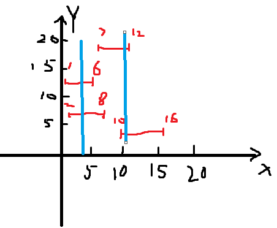
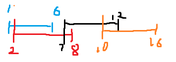
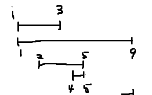

**452.用最少数量的箭引爆气球**

有一些球形气球贴在一堵用 XY 平面表示的墙面上。墙面上的气球记录在整数数组 `points` ，其中`points[i] = [xstart, xend]` 表示水平直径在 `xstart` 和 `xend`之间的气球。你不知道气球的确切 y 坐标。

一支弓箭可以沿着 x 轴从不同点 **完全垂直** 地射出。在坐标 `x` 处射出一支箭，若有一个气球的直径的开始和结束坐标为 `x``start`，`x``end`， 且满足  `xstart ≤ x ≤ x``end`，则该气球会被 **引爆** 。可以射出的弓箭的数量 **没有限制** 。 弓箭一旦被射出之后，可以无限地前进。

给你一个数组 `points` ，*返回引爆所有气球所必须射出的 **最小** 弓箭数* 。

看似题目高深难懂，其实就是找交集。



题目给出的气球是没有排序的，我们按照左边界从大到小排序。



初始化箭为1

对[1,6]，判断2小于[1,6]右边界，判断8和当前右边界哪个小，6更小，更新右边界为6。判断7大于6。箭数+1，更新右边界为12

判断10小于12，到尾了。

```c#
public class Solution {
    public int FindMinArrowShots(int[][] points) {
        Array.Sort(points, (a, b) => a[0].CompareTo(b[0])); // 按起始点排序
        int rightEdge = points[0][1];
        int answer = 1;
        if (points.Length == 1) return 1;
        for (int i = 1; i < points.Length; i++) {
            if (points[i][0] > rightEdge) { // 比较当前气球的起始点和 rightEdge
                answer++;
                rightEdge = points[i][1]; // 更新 rightEdge
            } else {
                rightEdge = Math.Min(points[i][1], rightEdge); // 更新 rightEdge
            }
        }
        return answer;
    }
}
```

`rightEdge = Math.Min(points[i][1], rightEdge); // 更新 rightEdge`这一段很重要，一开始写的是`rightEdge = Math.Min(points[i][1], points[i - 1][1]);`这种方式会导致右边界更新错误。



如果是正确更新：第一次更新3<9,为3。第二次更新3<5为3。第三次更新4>3,新增加一根。需要2根箭

如果是错误更新。第一次更新3<9,为3。第二次更新5<9为5。第三次更新4<5为4。判断只需要一根箭

，但是其实是需要两根