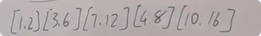
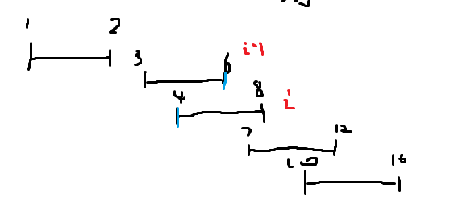
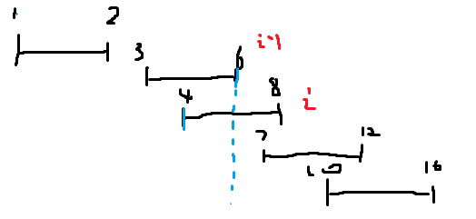

**435.无重叠区间**

给定一个区间的集合 `intervals` ，其中 `intervals[i] = [starti, endi]` 。返回 *需要移除区间的最小数量，使剩余区间互不重叠* 。

**注意** 只在一点上接触的区间是 **不重叠的**。例如 `[1, 2]` 和 `[2, 3]` 是不重叠的。

 

思路：给出

先按左边界从小到大排序，如果左边界相同的话，就按右边界从小到大排序。

```c#
Array.Sort(intervals, (a, b) => {
    int compareHeight = a[0].CompareTo(b[0]);
    if (compareHeight != 0) return compareHeight;
    return a[1].CompareTo(b[1]);
});
```



当遍历到3,6。3的左边界大于2.更新右边界为6.

当遍历到`i`，`i`的左边界比`i`-1的右边界大。那么就让`result++`。然后更新右边界为`i`和6里最小的那个。意思就是在下次比较之前，丢弃右边界更大的那个元素，使得下面的比较重叠区域尽可能少。s

