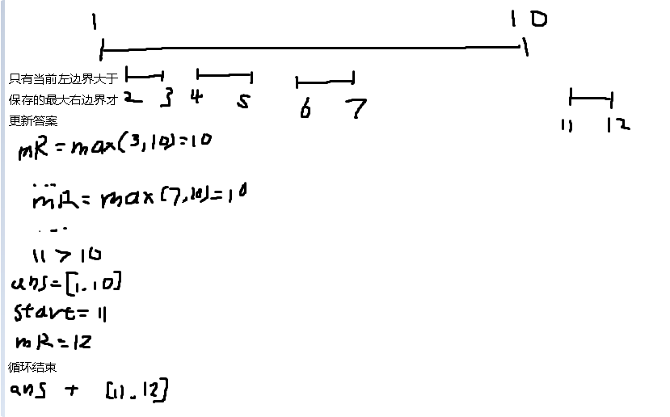

**56.合并区间**

以数组 `intervals` 表示若干个区间的集合，其中单个区间为 `intervals[i] = [starti, endi]` 。请你合并所有重叠的区间，并返回 *一个不重叠的区间数组，该数组需恰好覆盖输入中的所有区间* 。

```
输入：intervals = [[1,3],[2,6],[8,10],[15,18]]
输出：[[1,6],[8,10],[15,18]]
解释：区间 [1,3] 和 [2,6] 重叠, 将它们合并为 [1,6].
```

思路：当**左边界**小于**保存的最大右边界**就不断更新**最大右边界**为当前所有已遍历的右边界的**最大值**，这样才能尽可能多包括元素。当当前**左边界**大于**保存的最大右边界**时，就更新答案。循环结束之后把最后的答案加上。



```c#
public class Solution {
    public int[][] Merge(int[][] intervals) {
        // 1. 对区间数组进行排序
        // 排序规则：先按区间的起始点升序排序，如果起始点相同，则按结束点升序排序
        Array.Sort(intervals, (a, b) => {
            int cmp = a[0].CompareTo(b[0]); // 比较起始点
            if (cmp != 0) return cmp;       // 如果起始点不同，按起始点排序
            else return a[1].CompareTo(b[1]); // 如果起始点相同，按结束点排序
        });

        // 2. 初始化结果列表
        List<int[]> answer = new List<int[]>();

        // 3. 初始化当前区间的起始点和最大右边界
        int start = intervals[0][0];       // 当前区间的起始点
        int maxRightEdge = intervals[0][1]; // 当前区间的最大右边界

        // 4. 遍历排序后的区间数组
        for (int i = 1; i < intervals.Length; i++) {
            if (intervals[i][0] <= maxRightEdge) {
                // 5. 如果当前区间与上一个区间重叠，合并区间
                // 更新最大右边界为当前区间和上一个区间的结束点的最大值
                maxRightEdge = Math.Max(intervals[i][1], maxRightEdge);
            } else {
                // 6. 如果当前区间与上一个区间不重叠，将上一个区间加入结果
                answer.Add(new int[] { start, maxRightEdge });

                // 7. 更新当前区间的起始点和最大右边界
                start = intervals[i][0];
                maxRightEdge = intervals[i][1];
            }
        }

        // 8. 将最后一个区间加入结果
        answer.Add(new int[] { start, maxRightEdge });

        // 9. 将结果列表转换为数组并返回
        return answer.ToArray();
    }
}
```

