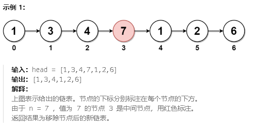

<span style="font-weight:bold;">2095.删除列表的中间节点</span>

给你一个链表的头节点 `head` 。**删除** 链表的 **中间节点** ，并返回修改后的链表的头节点 `head` 。

长度为 `n` 链表的中间节点是从头数起第 `⌊n / 2⌋` 个节点（下标从 **0** 开始），其中 `⌊x⌋` 表示小于或等于 `x` 的最大整数。

- 对于 `n` = `1`、`2`、`3`、`4` 和 `5` 的情况，中间节点的下标分别是 `0`、`1`、`1`、`2` 和 `2` 。

  

删除节点：直接把被删除的节点的前一个节点的指针指向被删除节点的后一个节点

快慢指针：快指针移动两步，慢指针就移动一步，这样当快指针移动到末尾时即 快指针指向的值为`null` 或 `fast.next == null`，慢指针刚到移动到中间位置。

```c#
public class Solution {
    public ListNode DeleteMiddle(ListNode head) {
        // 如果链表为空或只有一个节点，直接返回 null
        if (head == null || head.next == null) {
            return null;
        }
        // // 如果链表只有两个节点，直接删除第二个节点
        // if (head.next != null && head.next.next == null) {
        //     head.next = null;
        //     return head;
        // }
        // 快慢指针，初始化都指向头节点
        ListNode slow = head;
        ListNode fast = head;
        ListNode prev = null;
        // 快指针移动两步，慢指针移动一步
        while (fast != null && fast.next != null) {
            fast = fast.next.next; // 快指针走两步
            prev = slow;            // prev 指向慢指针的前一个节点
            slow = slow.next;       // 慢指针走一步
        }
        // 删除中间节点：让 prev 的 next 指向 slow 的 next
        prev.next = slow.next;
        // 返回修改后的链表头节点
        return head;
    }
}
```


