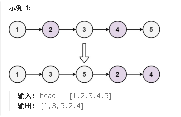

<span style="font-weight:bold;">328.奇数偶数链表</span>

给定单链表的头节点 `head` ，将所有索引为奇数的节点和索引为偶数的节点分别组合在一起，然后返回重新排序的列表。

**第一个**节点的索引被认为是 **奇数** ， **第二个**节点的索引为 **偶数** ，以此类推。

请注意，偶数组和奇数组内部的相对顺序应该与输入时保持一致。

你必须在 `O(1)` 的额外空间复杂度和 `O(n)` 的时间复杂度下解决这个问题。



<span style="color:#FF0000;">思路：把奇数索引节点连完，把偶数索引节点连完，最后把偶数索引链表连到奇数索引链表后面</span>

```c#
public class Solution {
    public ListNode OddEvenList(ListNode head) {
        if (head == null || head.next == null) {
            return head; // 如果链表为空或只有一个节点，直接返回
        }
        ListNode odd = head;//奇数
        ListNode even = head.next;//偶数
        ListNode evenHead = even;
        while(even != null && even.next != null){
            odd.next = odd.next.next;// 将奇数节点的 next 指向下一个奇数节点
            odd = odd.next;//这一步是必须的，要奇数节点后移

            even.next = even.next.next;
            even = even.next;//这一步是必须的
        }
        odd.next = evenHead;
        return head;
    }
}
```

