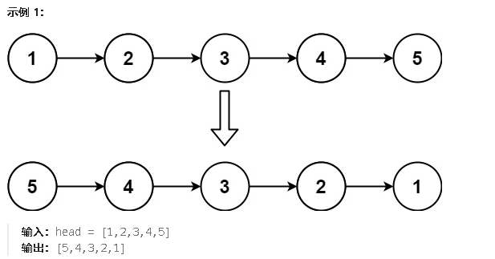

**206.反转列表**

给你单链表的头节点 `head` ，请你反转链表，并返回反转后的链表。



<span style="color:#FF0000;">思路：从左往右，让此节点的next指向左边的节点，然后更新指针。遍历到最后的时候，current为null，pre(是current的前一个节点)为初始链表的末尾，也是新链表的头节点。所以最后要返回pre</span>

```c#
//双指针写法
public class Solution {
    public ListNode ReverseList(ListNode head) {
        if(head == null)return head;
        ListNode current = head;
        ListNode pre = null;
        while(current != null ){
            ListNode temp = current.next;//先获取下一个节点
            current.next = pre;//让当前节点指向左边的节点
            pre = current;//往右移动pre指针
            current = temp;//往右移动cur指针
        }
        return pre;
    }
}
```

```c#
//递归写法
public class Solution {
    public ListNode ReverseList(ListNode head) {
        ListNode current = head;
        ListNode pre = null;
        return Reverse(current,pre);
    }

    public ListNode Reverse(ListNode cur,ListNode pre){
        if(cur == null)return pre;//如果cur为null表示递归结束
        else{
            ListNode temp = cur.next;//先获取下一个节点
            cur.next = pre;//让当前节点指向左边的节点
            //之后pre = current;//往右移动pre指针
            //current = temp;//往右移动cur指针
            //所以传入参数的时候，传入temp和cur
            return Reverse(temp,cur);//进行递归
        }
    }
}
```

